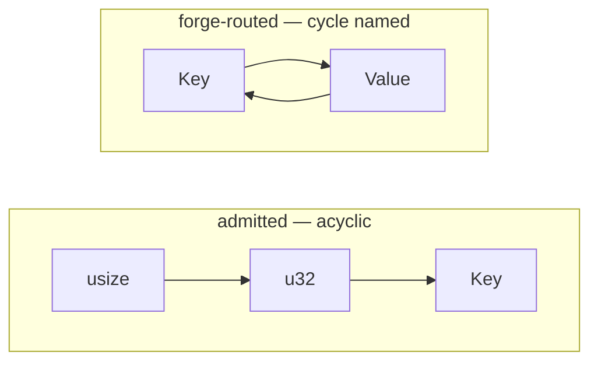
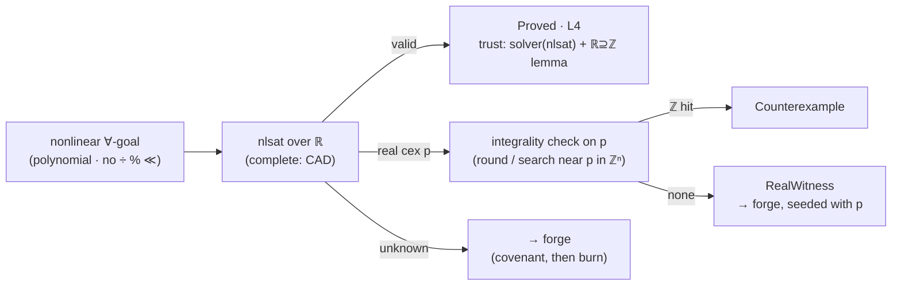

# RFC-1: Thermite 2 — a dependent-type tier, a stratified cage, and new ladder boundaries

| | |
|---|---|
| **Status** | Design sketch — not shipped software |
| **Supersedes** | RFC-1-draft1, RFC-1-draft2 |
| **Baseline** | `dollspace-gay/Thermite @ 93d3cbc0` |
| **Configuration** | C3′ (decision record in §12) |
| **Follow-up** | Stage-2 metatheory sketch (stratified-FOL spine extension) |

This document is **self-contained**: it specifies the full Thermite 2 design, not a delta against prior RFCs.

**Contents:** [§0 Abstract](#0-abstract) · [§1 Background](#1-background-thermite-1-in-five-sentences) · [§2 Ladder + verdicts](#2-the-ladder-and-the-verdicts) · [§3 The cage (L4)](#3-the-cage-l4) · [§4 Numeric routing + @bv](#4-numeric-routing) · [§5 The forge (L3)](#5-the-forge-l3) · [§6 Syntax summary](#6-syntax-summary) · [§7 Six programs](#7-six-programs) · [§8 The agent loop](#8-the-agent-loop) · [§9 Certificates](#9-certificates) · [§10 Anti-Goodhart](#10-anti-goodhart) · [§11 Trust base](#11-the-trust-base) · [§12 Staging + decision record](#12-staging-and-the-decision-record) · [§13 Limits](#13-limits-by-theorem)

---

## 0. Abstract

Thermite 2 is a verification-mandatory programming language for AI agents. Every function carries an enforced contract; every contract clause is proven, and the proof is graded on a five-rung ladder where **rank means refutation quality**. Three proof mechanisms serve the ladder:

- a **stratified SMT cage** (L4) — decidable by an admission test, push-button, every failure a concrete countermodel;
- a **kernel forge** (L3) — full dependent-type-theoretic propositions, proven by agent-authored proof terms checked by the Lean 4 kernel, paid in tokens, falsified by covenant;
- a **machine-semantics clause mode** (`@bv`) for bit-exact arithmetic, where everything — multiplication included — is decidable.

Obligations the cage cannot hold escalate **up** to the forge — never down the ladder. The thesis is unchanged from Thermite 1: burn the cheap resource (compute, tokens, patience) to buy the expensive one (trust).

## 1. Background: Thermite 1 in five sentences

Every Thermite function makes three promises as enforced syntax — `req` (what must hold before the call), `ens` (what the result guarantees), `fx` (everything the function may touch); omitting one is a compile error, and `fx` is additionally enforced at runtime by a kernel seccomp filter derived from it. Loops carry `inv` (why the loop is right) and `dec` (why it ends). The toolchain, `forge`, proves the promises through Verus/Z3 over a deliberately small contract language and grades each item on a ladder; a contract too weak to catch sabotage is rejected by an anti-gaming battery (vacuity detection plus mutation testing). A machine-checked Lean 4 soundness spine ties the production translation to a proven reference encoder via per-run translation validation, so the whole chain re-derives on a skeptic's machine. Agents write Thermite the way they converse: declare the contract with typed holes, read the goals, fill, re-check, repeat until *all goals discharged*.

**The problem Thermite 2 fixes.** In Thermite 1, the decidable contract fragment is a fixed menu (eight quantifier combinators with frozen SMT triggers), and a clause outside the menu slides *down* the ladder — to bounded checking or runtime monitoring. Expressiveness was paid for with assurance. The structural-limits analysis behind this RFC showed the menu's walls are theorems (undecidability of nonlinear integer arithmetic, of unrestricted quantification, of general inductive reasoning) — but also that the walls sit much further out than the menu does, and that a kernel-checked proof tier dissolves the expressiveness walls entirely at the price of a weaker refutation story. Thermite 2 therefore does two things: it pushes the decidable cage out to its principled boundary, and it adds a proof tier *above the slide* for everything past that boundary.

## 2. The ladder and the verdicts

Both top rungs mean *proven for every input*. They differ in what failure looks like: the cage's refutations are mechanically complete inside its fragment (a failed obligation always yields a countermodel), while the forge's refutation channel is a covenant — empirical, mandatory, but not complete. **That asymmetry decides the order, not expressiveness.**

| rung | name | mechanism | on failure |
|---|---|---|---|
| **L4** | caged | Stratified-FOL admission (§3) + linear arithmetic + relaxed nonlinear universals (§4) + machine-width clauses (§4). Discharged by Z3/Verus; tied to source meaning by per-run translation validation against the kernel-proven reference encoder. | A countermodel: a finite structure, an integer point, or a bit pattern. Mechanically complete in-fragment. Never degraded. |
| **L3** | forged *(new)* | Full propositions in Lean 4 CIC (§5); proofs authored by the agent, checked by the kernel, axiom-gated. Receives only what the cage genuinely cannot hold — and the classifier must name *why* (a routing reason from a frozen vocabulary, never a bare refusal). | The covenant runs first — a typed generator attempts refutation before any proof search; a hit is a hard fail. Past that: a stuck goal with hypotheses and a battery hint. |
| **L2** | bounded | Kani/CBMC: proven for all inputs up to a stated size. | A concrete trace within the bound. |
| **L1** | watched | Runtime contract monitoring; violations abort. The honest seam for syscall boundaries and `fx diverge` event loops. | An abort at the violating call, in production. |
| **L0** | slag | `#[slag]` — trusted by fiat, deliberately ugly, greppable; the complete inventory of faith. | Nothing. That is what the name is for. |

**Per-clause grading:** forge classifies each `req`/`ens`/`inv` individually; a function's level is the minimum over its clauses. An open hole — body (`?0`) or proof (`?p0`) — means the item cannot certify or build at all.

### The seven verdicts (a closed set)

Every obligation's outcome is one of seven verdicts — closed like the combinator registry was closed, for the same anti-laundering reason. No verdict ever converts into another silently; in particular, nothing on this list ever becomes `Proved` except `Proved`.

| verdict | channel | meaning | the agent's move |
|---|---|---|---|
| `Proved` | any | Obligation discharged; engine + trust base recorded in the certificate | continue |
| `Counterexample` | cage | A model of the negation. Hard fail; never softened into a lower grade | fix the code or the contract — the model says which |
| `RealWitness` | nonlinear route | Refuted over the reals, but no integer counterexample found; the claim may still hold over the integers | escalate to the forge; the real point seeds the proof attempt |
| `CovenantRefuted` | forge pre-pass | The falsifier found a concrete refutation before proof search began | same as `Counterexample` — it is one |
| `Stuck(goals)` | forge | Goals remain after the tactic battery; residual goals + hypotheses returned | burn: a lemma, a restatement, or a restratification upstream |
| `KernelBudget` | forge | Elaboration or normalization exceeded its budget. Not a failure, not a pass | split the goal, raise the budget, or restructure the term |
| `Timeout` | cage | Solver resource limit — the in-fragment cost cliff, named | a profile hint follows; restructure or re-route |

Two verdicts encode theorems. `RealWitness` exists because refutation over ℝ does not imply refutation over ℤ for universal claims. `KernelBudget` exists because kernel conversion checking is decidable but non-elementary in cost. Both follow the rule the rest of the toolchain already lives by: a resource exhaustion degrades loudly and is never fabricated into a finding or a pass.

## 3. The cage (L4)

### From a menu of combinators to an admission test

Thermite 1's eight combinators were the eight quantified shapes whose decidability its spine could prove. Thermite 2 generalizes the principle behind them: a quantified contract formula is **admitted to the cage** when its quantifier-alternation graph over sorts is acyclic — the criterion from the Ivy line of work, under which the formula lies in an essentially-finite fragment (EPR-reducible) where Z3's model-based quantifier instantiation (MBQI) is a genuine decision procedure. Index arithmetic inside admitted formulas is confined to array-property shapes; the precise admitted arithmetic–quantifier mix is the stage-2 metatheory deliverable (§12).

Three consequences:

1. **Membership is decidable.** The classifier builds the graph and checks acyclicity — no judgment calls, no heuristics, and a rejection always names the cycle.
2. **Failures are finite models.** A wrong quantified spec dies with a concrete small structure — an actual array, an actual map.
3. **The trigger layer is gone, not frozen.** Admitted formulas need no trigger annotations and cannot matching-loop; the entire heuristic apparatus the frozen triggers existed to tame is absent for them. The cost moved to model search — EPR is NEXPTIME-complete, so the cliff exists — but it terminates with a verdict either way, and exhaustion is the `Timeout` verdict, never an *unknown*.

The eight v1 combinators remain valid syntax and become *derived lemmas* over the admitted fragment. Every Thermite 1 program certifies unchanged, as a special case.

**The graph:** one node per sort; an edge `S → T` whenever a universally bound variable of sort S has an existentially bound (or Skolemized) variable of sort T inside its scope.



Left: `forall i: usize . exists v: u32 . …` — indices quantify over values, values over keys, nothing returns. Decidable; finite countermodels. Right: `forall k . exists v …` together with `forall v . exists k …` — Key and Value form a loop; the classifier reports the cycle, and the repair is mechanical.

### The repair verb: restratify

A cycle is broken by **naming the witness**: replace `exists v . maps(m, k, v)` with a derived `spec fn lookup(m, k)` and state `maps(m, k, lookup(m, k))`. The existential disappears, the edge disappears, the formula is admitted. The rewrite is checked, not trusted: forge automatically emits the in-cage side obligation that the restratified formula implies the original under the new definition — restratification can strengthen a spec, never weaken one. This is a purely syntactic, fully mechanical transformation whose error message contains everything needed to perform it: exactly the kind of repair an agent loop excels at. **Restratify joins fix-the-code and weaken-the-claim as the language's third repair verb.**

## 4. Numeric routing

### Real-relaxation: pure routing, zero new syntax

Nonlinear *integer* validity is undecidable (Matiyasevich); nonlinear *real* validity is decidable (Tarski; Z3's nlsat). And for universally quantified claims with polynomial atoms, validity over the reals implies validity over the integers. So: any universally quantified nonlinear goal over `nat`/`int` containing only polynomial atoms — no integer division, no modulo, no shifts — is routed to nlsat first. The source is untouched; only the certificate shows the engine.



The asymmetry is deliberate and sound: *proof* over ℝ is conclusive for ℤ; *refutation* over ℝ is not — so a real-only witness escalates instead of failing, and the witness point travels with the goal as proof-search guidance. One-sided completeness, honestly labeled, with the soundness lemma (`r_relax_sound`) stated and proven in the spine.

### `@bv` — the machine-semantics clause tag

A clause tagged `ens@bv64` (or `@bv32`, …) is interpreted over fixed-width wraparound semantics, where *everything* is decidable — multiplication, xor-rotate chains, hash mixers, modular identities — with bit-level countermodels (QF_BV; the backend is Verus's `by(bit_vector)` mode, nearly free).

The tag is loud on purpose: it is a **semantic fork**. Wraparound truth is not unbounded truth, and a clause moved to `@bv` where wrap makes it weaker is the design's one new gaming vector. Three locks, all mandatory:

1. every tagged clause carries a `bv_shadow` flag in its certificate — greppable at every layer slag is greppable at;
2. the mutation battery runs against bv semantics for tagged clauses;
3. the variant `@bv64(nowrap)` additionally emits a no-overflow side obligation — for when machine width is the domain but wrap is *not* the intent.

## 5. The forge (L3)

The forge is where a clause goes when no decision procedure can hold it: inductive structure, multiset equalities, ordinal termination, cyclic-quantifier specs the author chooses not to restratify. The contract is proved by a **proof term** the agent authors, elaborated and checked by the Lean 4 kernel against the same mechanized semantics the soundness spine already defines. The kernel is small (the de Bruijn criterion); the axioms are gated per item to exactly `{propext, Classical.choice, Quot.sound}` — the set the existing spine passes — and a `sorry` is a hole, and holes do not certify.

### The logic, fixed

| axis | choice | why (the losing alternative) |
|---|---|---|
| Type theory | Intensional CIC — Lean 4, the spine's own kernel | Extensional TT has undecidable type-checking (Hofmann). A wall, not a preference. |
| Axioms | `{propext, Classical.choice, Quot.sound}`, gated per item | The audit's existing axiom probe applies verbatim. |
| Quotients | Permitted in `prop fn` | Kernel-native; buys `Multiset`, so permutation is an equality rather than a counting trick. |
| Proof irrelevance | Definitional (native `Prop`) | Refinement payloads erase for free; codegen sees only the value. |
| Elaboration | Generated proofs restricted to Miller-pattern implicits | Full higher-order unification is undecidable (Goldfarb); the pattern fragment is the decidable island. Predictable elaboration beats expressive elaboration for an agent loop. |
| Tactics | Frozen battery + **frozen simp set** | An open simp set is the matching-loop hazard reborn. The trigger-freezing philosophy, applied to tactics. |
| Termination | `dec lex(…)` built-in; `dec wf ⟨rel⟩` with an accessibility proof | Sized-types conveniences have a soundness-bug history; accessibility recursion has the same reach, conservatively. |

### The surface: four constructs

- **`prop fn`** — the uncaged sibling of `spec fn`: unbounded quantifiers, inductive predicates, quotient types, real implication, over the same value vocabulary. Any clause mentioning one is forge-routed.
- **`lemma`** — a named, proved proposition; the reusable currency of the tier (burned once, cited forever).
- **`proof` blocks** — attached to a function, discharging its forge-routed clauses goal by goal through the frozen battery (`omega`, `simp`, `nlinarith`, `induction`, `decide`, `calc`, `exact`, `from`, `push_neg`); unproven goals are typed proof holes `?p0`, mirroring body holes.
- **Refinement types** — sugar that moves contracts into signatures: `n: u64{n > 0}` desugars to a `req`, a refined return to an `ens`, and a refined `type` alias makes the obligation portable to call sites, where it is discharged in whichever tier the caller's evidence lives (most often the cage, for free).

### The falsification covenant

Type theory's structural weakness is that a failed proof search is a stuck goal, not a disproof. The covenant is the design's answer, and it is mandatory: before any proof search, every forge-routed clause owes

- **`inhabit` witnesses** — concrete inputs satisfying `req`, required *by exhibition* because inhabitation is undecidable to check; and
- a **`falsify` budget** — a deterministic typed generator (seeded, reproducible) attacks the claim on the executable semantics.

A refutation found here is the verdict `CovenantRefuted` — a concrete counterexample and a hard fail, the cage's rule recovered. Only past a clean falsifier does token burn begin, which means a *false* forge claim almost always dies as a counterexample rather than as an unfalsifiable stuck state.

### The meaning audit

Expressive specs widen the gap between what was proved and what was meant. Two quotas keep it auditable: a **definition-tower budget** — a depth/size cap on the `prop fn` definitions a contract may stand on — and `forge audit --meaning`, which prints the fully unfolded tower for human sign-off and pins its hash in the certificate. The cage's legibility, re-imposed as a quota where it can no longer hold by construction.

## 6. Syntax summary

| form | tier | meaning |
|---|---|---|
| `forall x: T . P` / `exists x: T . P` | cage if stratified | Raw quantifiers in contract position; admitted when the sort graph is acyclic, forge-routed (cycle named) otherwise |
| `x: T{P(x)}` | either | Refinement type; desugars to `req`/`ens`, classified per the refinement |
| `type name(args) = x: T{P}` | either | Refined alias; the obligation travels to call sites |
| `ens@bvN P` / `@bvN(nowrap)` | cage (bv) | Clause interpreted at machine width; shadow-flagged; `nowrap` adds the no-overflow side obligation |
| `prop fn` | forge | Uncaged specification function: full propositions, quotients |
| `lemma name(args) req … ens … proof { … }` | forge | Named proved proposition; citable in proof blocks |
| `proof for f { ens#k by { … } }` | forge | Discharges f's forge-routed clauses via the frozen battery; `?pN` are proof holes |
| `witness { inhabit (…); falsify N; }` | forge | The covenant: mandatory for any item with forge-routed clauses |
| `dec lex(a, b, …)` / `dec wf rel proof { … }` | either / forge | Lexicographic measures; arbitrary well-founded relations with an accessibility proof |

**Unchanged from Thermite 1:** `req`/`ens`/`fx` mandatory on every fn; `inv`/`dec` on loops; `spec fn`; `#[slag]` and `#[boundary]`; typed body holes `?N`; the seccomp cage derived from `fx`; the certificate-per-item model. Every Thermite 1 program is a Thermite 2 program with the same or better grade.

## 7. Six programs

### A — Thermite 1 compatibility: the cage keeps everything it had

```rust
fn sum(xs: &[u32]) -> u64
  req xs.len() <= 1_000_000        // → L4
  ens result == spec_sum(xs)       // → L4
  fx  pure
{
  let mut acc: u64 = 0;
  let mut i: usize = 0;
  while i < xs.len()
    inv acc == spec_sum(&xs[..i])
    dec xs.len() - i
  {
    acc = acc + xs[i] as u64;
    i = i + 1;
  }
  acc
}
```

### B — Raw quantifiers in-cage: binary search without combinators

Sortedness and not-found are plain ∀-formulas. The classifier admits both (index sorts quantify over element values — acyclic; array-property shape), MBQI decides them, and a wrong program dies with a finite model: a concrete array.

```rust
fn binary_search(xs: &[u32], needle: u32) -> (r: Option<usize>)
  req forall i: usize, j: usize .
        i <= j && j < xs.len() ==> xs[i] <= xs[j]      // raw forall — strat: usize ≻ u32, acyclic → L4
  ens match r {
        Some(i) => i < xs.len() && xs[i] == needle,
        None    => forall i: usize .
                     i < xs.len() ==> xs[i] != needle, // raw forall — admitted, no trigger → L4
      }
  fx  pure
{
  // body as in v1 — loop inv/dec unchanged
}
```

### C — Nonlinear arithmetic, push-button: the real-relaxation route

Integer square root. Both postconditions multiply a variable by itself — classically the point where SMT becomes heuristic and old Thermite capped at runtime checks. Here both are universally quantified polynomial claims: nlsat decides them over ℝ, the ℝ→ℤ lemma carries the result, and the item is push-button L4 — no proof block, no covenant.

```rust
fn isqrt(n: u64) -> (r: u64)
  req n <= 1_000_000_000_000
  ens r * r <= n                       // nonlinear ∀-goal, polynomial: ℝ-relax route → L4 (engine: nlsat)
  ens n < (r + 1) * (r + 1)            // same route → L4
  fx  pure
{
  let mut r: u64 = 0;
  while (r + 1) * (r + 1) <= n
    inv r * r <= n
    dec n - r * r
  { r = r + 1; }
  r
}
// no proof block, no witness block: nothing here routes to the forge.
// covenant and burn are forge obligations only.
```

### D — Hash mixing at machine width: the @bv clause

The SplitMix64 finalizer. Its avalanche identity and its *injectivity* — a 64-bit bijection claim, hopeless over unbounded integers — are decidable at `@bv64`. The zero-fixpoint clause stays in unbounded semantics: one function, three labeled mechanisms. (Decidable is not cheap: bit-blasting two 64-bit multiplies is the in-fragment cost cliff; the budget verdicts apply.)

```rust
fn mix64(z: u64) -> (r: u64)
  ens@bv64 r == (z ^ (z >> 30)) * 0xBF58_476D_1CE4_E5B9     // wrap intended → L4 @bv64
  ens      z == 0 ==> r == 0                                 // unbounded semantics → L4
  fx pure
{ /* ... */ }

lemma mix64_injective(a: u64, b: u64)
  ens@bv64 mix64(a) == mix64(b) ==> a == b   // a 64-bit bijection claim — decidable at @bv64
// no proof block: QF_BV decides it. expensive (two 64-bit multiplies, bit-blasted) —
// budgeted, never unknown.
```

### E — The forge keeps what is genuinely its own: merge

Sortedness: raw quantifiers, admitted — L4. Length: linear — L4. Permutation: a *quotient multiset equality*, which no decision procedure holds and none should — L3, with a four-line inductive proof citing two library lemmas. This is the shape of every remaining forge obligation: structural, reusable, compounding.

```rust
prop fn melems(s: Seq<u32>) -> Multiset<u32> {     // quotient type: List modulo permutation
  fold s with insert into Multiset.empty
}

fn merge(a: &[u32], b: &[u32]) -> (out: Vec<u32>)
  req forall i, j: usize . i <= j && j < a.len() ==> a[i] <= a[j]   // strat ✓ → L4
  req forall i, j: usize . i <= j && j < b.len() ==> b[i] <= b[j]   // strat ✓ → L4
  req a.len() + b.len() <= 1_000_000                                 // → L4
  ens forall i, j: usize . i <= j && j < out.len() ==> out[i] <= out[j]  // → L4
  ens out.len() == a.len() + b.len()                                 // → L4
  ens melems(out) == melems(a) + melems(b)         // multiset equality — the forge → L3
  fx  alloc
  witness {
    inhabit (a = [1, 3], b = [2]);
    inhabit (a = [], b = []);
    falsify 50_000;                                // refutation budget, runs before proof search
  }
{ /* two-pointer merge; loop inv/dec elided for the sketch */ }

proof for merge {
  ens#3 by {
    induction merge_step;
    simp [melems_cons, melems_append];             // library lemmas: burned once, cited forever
  }
}
```

Item level = min over clauses = **L3**.

### F — Restratification, end to end

A bidirectional key/value invariant creates a Key ⇄ Value cycle. The fix is the named-witness move — and the result is a *stronger*, more explicit contract. The repair verb improves specs as a side effect.

**Before (cycle):**

```rust
struct Store { m: Map<Key, Value> }
  inv forall k: Key . has_key(m, k) ==> exists v: Value . maps(m, k, v)        // Key ≻ Value → L3
  inv forall v: Value . in_range(m, v) ==> exists k: Key . maps(m, k, v)       // Value ≻ Key → L3
// classifier: alternation cycle Key ⇄ Value — forge-routed unless restratified
```

**After (restratified):**

```rust
spec fn lookup(m: Map<Key, Value>, k: Key) -> Value      // the witness, named
spec fn owner(m: Map<Key, Value>, v: Value) -> Key       // its dual

struct Store { m: Map<Key, Value> }
  inv forall k: Key . has_key(m, k) ==> maps(m, k, lookup(m, k))     // Key ≻ Value only → L4
  inv forall v: Value . in_range(m, v) ==> maps(m, owner(m, v), v)   // Value ≻ Key only — no loop closes → L4
// both edges exist but no existential closes a cycle: graph acyclic — admitted
// forge also emits the side obligation: restratified ==> original (checked in-cage)
```

## 8. The agent loop

The loop's quality lives in its failure messages: every routing decision and every verdict comes from a frozen vocabulary, so the agent's next move is a lookup, not a guess. Four sessions, four repair verbs:

```text
$ forge check kv.th
  classify : inv#1  forge-routed — alternation cycle: Key ⇄ Value
             edges: forall k:Key ≻ exists v:Value (inv#1) · forall v:Value ≻ exists k:Key (inv#2)
             repair: name the witness — replace the existential with a derived spec fn (restratify)

$ forge edit kv.th --restratify inv#1 --witness lookup
  rewrote : exists v . maps(m,k,v)  →  maps(m, k, lookup(m, k))   + spec fn lookup added
  emitted : side obligation: restratified ==> original   [cage] · Proved

$ forge check kv.th
  classify : inv#1 cage (strat: Key ≻ Value, acyclic) · inv#2 cage
  solve    : MBQI · Proved · Proved   trust: solver(z3-epr)
  item kv certified L4 — no triggers, no covenant, no burn

$ forge check mix64.th
  classify : ens#1 cage@bv64 · ens#2 cage@bv64 · ens#3 cage
  solve    : ens#1 Proved (0.8s) · ens#2 Counterexample
             model: z = 0x8000_0000_0000_0001 — the truncated rotate is not injective; bit pattern attached
  …agent fixes the rotate width, re-checks: Proved (41s — the bv cost cliff, within budget)

$ forge check merge.th
  classify : ens#1 cage · ens#2 cage · ens#3 forge (prop fn melems: quotient type)
  covenant : inhabit ✓ (2 witnesses) · falsify 50,000 generated · 0 refuted
  goals    : ?p0 : melems(out) == melems(a) + melems(b)

$ forge fill merge ?p0 "induction merge_step; simp"
  kernel: stuck — residual: melems(push(out, x)) == insert(x, melems(out))
  hint: the frozen simp set lacks a push/insert bridge — state it as a lemma

$ forge fill merge ?p0 "induction merge_step; simp [melems_cons, melems_append]"
  kernel: goal closed · axioms ⊆ {propext, Classical.choice, Quot.sound} · proof 287 tokens
  item merge certified L3 (clauses: L4, L4, L3)
```

The four verbs in order: **restratify** (kv — re-routed to push-button, with the strengthening side obligation auto-checked), **fix the code** (mix64 — a bit-level model said exactly what), **burn** (merge — including one honest `Stuck` with a battery hint, the forge's characteristic failure mode), and the always-available fourth verb, **weaken the claim**. Note the merge covenant ran before any proof search: a false permutation claim would have died there as a concrete refutation.

## 9. Certificates

The certificate model is Thermite 1's (a JSON manifest per item, oracle-stable, cache-keyed), extended per clause: the `engine` block names the mechanism, and a new `trust:` field names exactly what discharging this clause asked you to believe. The ladder stays one-dimensional in the product; the trust dimension lives here and is aggregated by the audit into the residual-trust statement. Forge-tier certificates additionally carry the covenant evidence, the burn receipt (the spent tokens, recorded — the thesis, kept honest), and the meaning-audit pin.

**isqrt — relaxed L4:**

```json
{
  "item": "isqrt", "clause": "ens#1",
  "level": "L4",
  "engine": { "kind": "nlsat", "route": "real-relaxation",
              "soundness": "forall-polynomial: valid(R) implies valid(Z)  [spine lemma r_relax_sound]" },
  "trust": "solver(nlsat) + spine-lemma(kernel)",
  "tv": { "verdict": "Faithful", "reference": "ref_encode (stage-2 stratified ext)" },
  "falsification_channel": "integer countermodel (integrality-checked); RealWitness escalates"
}
```

**mix64 — @bv64 L4:**

```json
{
  "item": "mix64", "clause": "ens#1",
  "level": "L4",
  "engine": { "kind": "verus-z3", "mode": "bit_vector", "width": 64 },
  "trust": "solver(z3-qfbv)",
  "bv_shadow": { "flagged": true, "semantics": "wraparound",
                 "nowrap_obligation": null,
                 "note": "clause meaning differs from unbounded semantics — greppable, like slag" },
  "mutation": { "semantics": "bv64", "killed": 9, "scored": 10 },
  "falsification_channel": "bit-level model (mechanically complete)"
}
```

**merge — forge L3:**

```json
{
  "item": "merge", "clause": "ens#3",
  "level": "L3",
  "engine": { "kind": "lean-kernel", "version": "4.29.0",
              "axioms": ["propext", "Classical.choice", "Quot.sound"],
              "quotients": ["Multiset"] },
  "trust": "kernel + exporter(inspection, drift-pinned)",
  "covenant": { "inhabit": 2, "falsify": { "generated": 50000, "refuted": 0, "seed": 4096 } },
  "mutation": { "mode": "re-elaboration", "killed": 15, "scored": 16 },
  "meaning_audit": { "tower_depth": 2, "tower_budget": 4, "unfolded_hash": "c41a…", "human_ack": true },
  "burn": { "proof_tokens": 287, "lemmas_cited": ["melems_cons", "melems_append"] }
}
```

## 10. Anti-Goodhart

A passing grade must be hard to fake, per tier. The cage battery is Thermite 1's, unchanged; the forge battery is its counterpart against a larger gaming surface; the bv locks close the one vector this design adds.

| defense | cage (L4) | forge (L3) |
|---|---|---|
| Vacuous precondition | The solver proves `false` under `req` → reject | Undecidable to check — so **required by exhibition**: `inhabit` witnesses are mandatory; no witness, no certificate |
| Tautology (ens ignores the body) | Empty-body harness proves `ens` from types alone → reject | **Arbitrary-result re-elaboration**: substitute an opaque result into the proof term; if it still elaborates, the `ens` said nothing → reject |
| Weak contract | Mutation battery; kill-ratio floor; prover-proved equivalent-mutant exclusion | **Re-elaboration mutation** — strictly sharper: each mutant body is substituted under the existing proof term, and "the proof breaks" is decidable per mutant, kernel-guaranteed. (Deciding a survivor is *equivalent* stays undecidable — Budd–Angluin — so survivors keep counting against the floor.) |
| Wrong theorem proved | Cage poverty keeps contracts legible by construction | Definition-tower budget + the meaning audit (§5), hash-pinned in the certificate |
| Proof-cheat escapes | No `assume`, no external-body outside slag | Per-item axiom gate; `sorry` is a hole; holes never certify |

Two cross-tier vectors, with their locks:

- **@bv weakening** — tagging a clause `@bv64` so wraparound makes it vacuously easier. Locks: the `bv_shadow` flag (greppable like slag), bv-semantics mutation for tagged clauses, and the `nowrap` side obligation when wrap is not intended.
- **Restratify laundering** — could naming a witness weaken the spec? Impossible by construction: the rewrite emits the implication side obligation (restratified ⟹ original), checked in-cage; the move can strengthen a spec, never weaken one.

**The one place the forge beats the cage:** re-elaboration mutation is cheaper, deterministic, and more meaningful than per-mutant solver runs — a proof term that survives a body mutation has measured the contract's blind spot exactly. The anti-gaming layer is the unexpected beneficiary of the kernel tier.

## 11. The trust base

| you are trusting… | L4 clauses | L3 clauses |
|---|---|---|
| Lean kernel + {propext, Classical.choice, Quot.sound} | yes (via the soundness spine and TV) | yes (directly — the proofs live here) |
| Z3 / Verus solver soundness | yes (per query; ~500 kLOC of solver; proof reconstruction migrates this to the kernel where the fragment allows — §12 stage 3) | **no** |
| S = the intended meaning of the spec | yes | yes, **and harder** — hence the meaning audit; irreducible on every tier |
| Rust↔Lean correspondence (inspection tier) | yes (the reference encoders; SHA-pinned + drift-tripwired) | mostly no — obligations export straight into the proven semantics; the exporter itself stays inspected |
| Erasure / extraction to the running binary | n/a — Verus verifies the Rust that compiles | **yes — new**: refinements and proof terms vanish at codegen; the proven term and the compiled body are tied by the lowering once, not per query |
| rustc / LLVM | yes | yes |

**The floor (Gödel II), permanent on both tiers:** no tier proves its own checker sound. The residual list shrinks and changes shape; it never empties — which is why the residual statement remains the last thing the audit prints.

The trade in one line: L4 trusts a large heuristic solver on every query; L3 trusts a small kernel on every query plus one erasure link amortized across all of them. A good trade, probably — and "probably" is why L3 ranks below the rung whose refutations are mechanically complete.

## 12. Staging and the decision record

This configuration (**C3′**) was selected from four candidate packages:

| package | verdict | reason |
|---|---|---|
| C1 — conservative core (forge under the v1 menu) | rejected | The cage is too small, so burn dominates and the covenant becomes the primary refutation channel for most of the language. A proof assistant wearing an SMT hat. |
| C2 — stratified cage | adopted as base | Best failure actionability (the restratify repair verb); loses only on numeric coverage. |
| **C3′ — wide-spectrum, staged** | **chosen** | C2 + ℝ-relaxation (pure routing, near-zero metatheory, large coverage win) + @bv as an explicitly tagged, shadow-flagged, last-staged opt-in — the one risky piece, isolated. |
| C4 — grid ladder (refutation × trust as product surface) | demoted to metadata | The 2-D decomposition is true and lives in the `trust:` field and `make audit`; the ladder keeps the product's legibility. |

Rollout is ordered by risk isolation, not demo value; each stage states what is proven while it ships, and the system never claims the next stage's trust story early.

**Stage 1 — the forge tier + real-relaxation routing.** The kernel tier (export bridge grown from the existing obligation exporter; covenant; battery; the verdicts `Stuck`/`KernelBudget`/`CovenantRefuted`) plus nlsat routing with `RealWitness`. No spine change; the cage is still the v1 combinators.
> *Honest residual during stage 1:* the ℝ→ℤ soundness lemma is stated and proven in the spine (one page). Forge obligations trust the kernel plus the exporter (inspection tier, drift-pinned). The headline lands here: out-of-cage no longer degrades.

**Stage 2 — the stratified cage + the spine extension.** The admission classifier (sort-graph construction, cycle reporting, the restratify rewrite + its implication side obligation) ships against a stratified-FOL extension of the Lean spine: denotation for the admitted fragment, reference encoder, soundness theorem, TV obligation shapes. The combinators become derived lemmas.
> *Honest residual during stage 2:* until the spine extension is green, stratified formulas run under per-run TV against an unproven reference — existential evidence, labeled as such in the certificate's `trust:` field. The system admits them but does not claim the universal theorem over them. This is the months-not-weekend stage and the subject of the follow-up metatheory document.

**Stage 3 — @bv clause mode + reconstruction by default.** `@bv` with all three locks, riding the bit-vector solver mode; SMT proof reconstruction (the cvc5/kernel-replay path) flipped to default-on where the fragment supports it, migrating cage clauses' trust base from solver to kernel without touching their rung.
> *Honest residual during stage 3:* the bv semantic fork exists from day one of this stage — the locks ship with the feature, not after. A build without the shadow-flag plumbing does not get the tag.

## 13. Limits, by theorem

Every item below is a theorem, not an engineering gap. The design's posture toward each is the same as Thermite's everywhere: degrade loudly, never launder.

- **Cost cliffs inside decidable land** (Fischer–Rabin; CAD lower bounds; EPR is NEXPTIME-complete; 64-bit bv multiplication is brutal for SAT). Every cage enlargement trades *unknown* for *expensive* — the right trade, since expensive gets a budget verdict and a profile — but L4's growth is bounded by feasibility, not logic. **The practical admission test is decidable-and-affordable.**
- **The real-relaxation gap has a name** (Matiyasevich). Integer-essential claims — divisibility, exact division and modulo, claims true over ℤ but false over ℝ — stay forge-bound. `RealWitness` is the honest marker of exactly this gap.
- **@bv is two truths, permanently.** Wraparound and unbounded semantics will never agree, and no lock changes that — the locks keep the fork *visible*. A certificate on a bv-heavy module must keep saying "this is modular arithmetic" forever.
- **The covenant is empirical, not complete.** A falsifier-clean false claim still dies as wasted tokens, not as a model. This is the structural reason the forge ranks below the cage, and no amount of generator engineering closes it — only narrows it.
- **The forge's walls stand** (Goldfarb; Pollack-consistency; Budd–Angluin). Elaboration outside the pattern fragment, the proved-vs-meant gap, and surviving equivalent mutants — each undecidable, each managed by quota or exhibition rather than solved. The forge shrank in docket, not in difficulty per item.
- **The floor and the residue are permanent** (Gödel II; Rice). No tier proves its own checker; some true obligations stay out of reach at every rung forever. The roadmap question is never "when does everything reach the top" but **"which decidable islands next, at what cost, with the honest-degradation machinery scaling alongside."**

---

*Next document: the stage-2 metatheory sketch — the stratified-FOL spine (denotation for the admitted fragment, the reference encoder, the soundness theorem, the TV obligation shapes, and the proof that the admission classifier and the proven fragment coincide).*

*RFC-1 · Thermite 2 · design sketch — not shipped software · supersedes RFC-1-draft1 and RFC-1-draft2 · baseline `dollspace-gay/Thermite @ 93d3cbc0`.*
